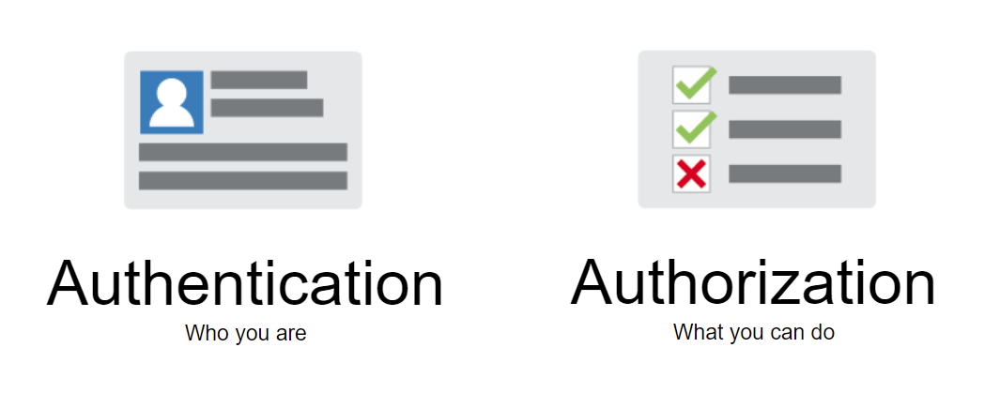

### x-api-key
API Gateway 透過 `x-api-key` 進行驗證(含授權)。Client 透過事先申請取得 `x-api-key`，於呼叫 API 時，將 `x-api-key` 存放於 HTTP Header 一併送出

```
Example

x-api-key: 1234567890abcdef
```

### XNAPI-TOKEN
外部叫用 API 時，透過 `XN-API-TOKEN` 決定該 API 可執行範圍 (Scope)

`XN-API-TOKEN` 透過 HTTP Header 送出

### XNSERVICE-CERT
!!!info "*[待定] 內部服務通訊憑證*"