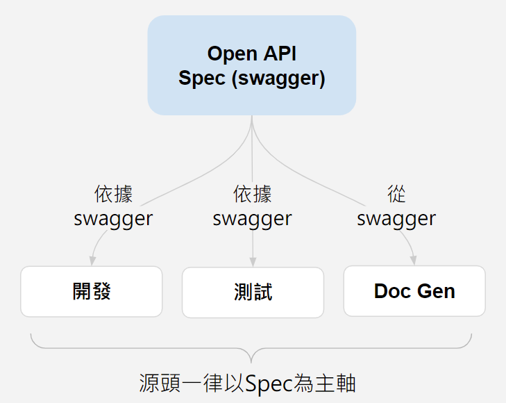

!!!warning "Mandatory"
### 原則
為確保 API 實際運行結果與提供的文件規格一致，開發 Web API 時，應遵循 **`spec first`** 流程與規範。文件先行，所有協作者皆對齊文件規格實作、測試及驗證。API Spec 文件，統一採用 `swagger` 格式撰寫。



### Swagger
- Minimum Requirement: OpenAPI Specification v3.0 以上
- 撰寫規範
    - 必要內容
        - API 功能與用途描述
        - **`Request Headers`**
        - **`Request Parameters`** 包含各參數欄位意義說明、資料型別，若為`EUNM`參數，則需列舉可接受的`值`
        - **`Response`** http status code 2xx / 4xx 回傳的內容格式
    - 其他
        - swagger 原始碼檔案 (*.json / *.yaml) 中的 API version，應該要和服務 build 的版本一致 (例如 v1.0.3)，遵循 Semantic Versioning 原則，而不是只寫 v1

        - 人工撰寫 swagger 時，特定寫法與 code gen 產生格式有差異，需特別留意 => 待補

- 參考範例 - [Express Shopping API (beta)](https://backoffice.qa.91dev.tw/docs/api/0#tag/Checkouts/paths/~1checkouts~1api~1createExpressCollection/post){target=_blank}

```
  ### 產生快速結帳連結 API swagger yaml 內容
  /checkouts/api/createExpressCollection:
    post:
      x-nineyi-type: public
      tags:
      - Checkouts
      summary: 產生快速結帳連結
      description: |

        * type 中的 Instant 主要為前台商品頁點擊立即結帳後使用，生命週期只有 30 分鐘，不允許更新跟刪除

        * DefaultCheckoutUrl 會因為 Type 的不同而對應回傳 LIFF 版本連結或是一般 WEB 版連結

      parameters:
        - name: X-API-KEY
          in: header
          required: true
          schema:
            type: string
        - name: XNAPI-TOKEN
          in: header
          required: true
          schema:
            type: string
      requestBody:
        required: true
        content:
          application/json:
            schema:
              $ref: '#/components/schemas/ExpressCollectionEntity'
            example:
              Title: Give a title of the collection
              SkuList:
                - SkuId: '272490'
                  Qty: 2
              InStoreCode: an in-store code here
              Type: LINE
              ValidFrom: '2021-11-13T00:00:00Z'
              ValidUntil: '2022-01-01T00:00:00Z'
              TrackingCode: customTrackingCode
      responses:
        200:
          description: Ok
          headers:
            XNTRACE-ID:
              $ref: '#/components/headers/XNTRACE-ID'
            XNAPI-VERSION:
              $ref: '#/components/headers/XNAPI-VERSION'
          content:
            application/json:
              schema:
                $ref: '#/components/schemas/CreateExpressCollectionResponseEntity'
              example:
                Id: 1993ffa2-b69a-4790-a3b9-598d69cfeb0c
                DefaultCheckoutUrl: 'https://{shop-domain}/v2/checkouts/1993ffa2-b69a-4790-a3b9-598d69cfeb0c'
        400:
          description: BadRequest
          headers:
            XNTRACE-ID:
              $ref: '#/components/headers/XNTRACE-ID'
            XNAPI-VERSION:
              $ref: '#/components/headers/XNAPI-VERSION'
          content:
            application/json:
              schema:
                $ref: '#/components/schemas/ErrorResponseEntity'
              examples:
                InvalidShopId:
                  value:
                    ReturnCode: InvalidShopId
                    Message: The requested ShopId was invalid.
                InvalidParameter:
                  value:
                    ReturnCode: InvalidParameter
                    Message: The requested {Parameter} was invalid.
                  description: '{Parameter} 請帶入錯誤的參數名稱，此 API 需檢查 Title, SkuList, Type, ValidFrom, ValidUntil 資料與規格正確；當 Type = Instant 時，ValidFrom, ValidUntil 不需要帶，帶了會忽略。'

```
