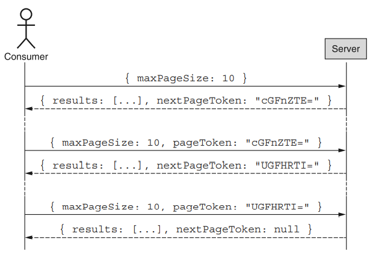

### 說明
API 實作分頁的目的，主要是效能上的考量。單次請求大量資料傳輸，除了對 Server side 造成負擔外，對 API 串接者的使用體驗也不好，為了解決這個問題，分頁就是一個重要的工具。

### 考量要點
如何用合理的方式將 data 分成多個 HTTP request，讓回傳時的 response payload 大小不會過大。舉例，當 API latency 超過 30 秒 (API gateway hard limit) 時，你應該要思考這樣的回應速度是否合理？亦或是否應實作分頁以降低 Response 傳輸量。

一個好的分頁 API 應該要能讓使用者選擇一次可回傳多少個 items，但仍必須要設定上限，避免使用者輸入太大的數字造成後端 Server 的負擔。

### 實作建議
API 分頁大致有以下實作方法

* Page-based (Offset and limits) pagination

    Page-based 是最常見的作法。直接讓使用者指定頁數的大小和頁碼，然後回傳當前的頁碼、單頁總數、總頁數等資訊。缺點是，過程中若 DB 有新增或刪除資料，使用者在換頁時，可能發生資料重覆取得或少出現的狀況

```
    // GET /orders?pageIndex=1&pageSize=20
    {
        "comments": [],
        "pagination": {
            "pageIndex": 1,
            "pageSize": 20,
            "totalSize": 30
        }
    }
```

* Cursor-based pagination

    Cursor-based 是 API 分頁另一種設計方式。由 Server side 控制回傳指標指向下一頁，Cursor 通常會經過編碼，Client side 無法直接操作它。面對大量資料查詢，此方法效能優於 `Page-based` 分頁方法，並且可解決 Page-based 在 DB 新增或刪除資料，可能發生資料重覆取得或少出現的狀況；但若需要取得總筆數 / 總頁數資訊，Server side 會有額外的工要做。

    
```
    // GET /orders?maxPageSize=10&pageToken=cGFnZTE=
    {
        "comments": [],
        "pagination": {
            "nextPageToken": "UGFHRTI="
        }
    }
```
!!!info "*此方法適合單向分頁，依序往下巡覽資料；若有雙向巡覽(回上一頁)或指定取得某一頁資料的需求，則需要考慮使用 Page-based pagination*"

<!-- ### 現行 SCM API 分頁方法
採用 Page-based pagination，Request payload 包含 `Position (位置)` `Count (取回資料筆數)` 參數

```
    // 查詢已出貨之超取、門市自取、貨到付款的訂單
    // https://api.abc.com/cart/v1/order:shipping-status
    // Request payload 範例

    {
        "ShopId":64,
        "OrderDeliverType":"",
        "DistributorDef":"",
        "TemperatureTypeDef":"",
        "StartDate":"2021-02-05T00:00:00",
        "EndDate":"2021-02-05T02:59:00",
        "Position":0,
        "Count":100
    }
``` -->

### Reference
* [Paginating Requests in APIs](https://ignaciochiazzo.medium.com/paginating-requests-in-apis-d4883d4c1c4c){target=_blank}
